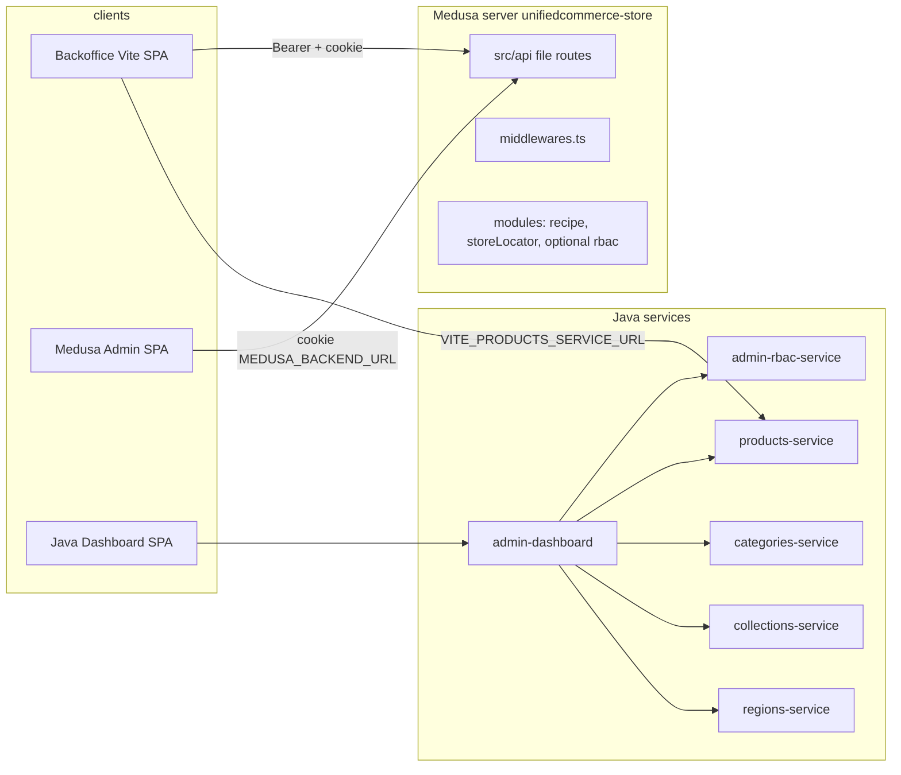

# Store backend admin: end-to-end flows, Medusa internals, and Java rewrite map

This document describes how **administration** works across the UnifiedCommerce repo today: the **React backoffice** (`unifiedcommerce-store-backoffice`), the **Medusa Admin** UI extensions (`unifiedcommerce-store/src/admin`), the **Medusa HTTP API** (`unifiedcommerce-store/src/api`), middleware, **RBAC**, and the **Java admin-dashboard** / **admin-rbac-service** path. It is written to support **rebuilding admin UIs with different layouts** on Java microservices while preserving behavior.

---

## 1. High-level topology

| Surface | Port (typical) | Base URL env | Purpose |
|--------|----------------|--------------|---------|
| Medusa API | 9000 | `DATABASE_URL`, `JWT_SECRET`, CORS vars | Core commerce + custom routes |
| Backoffice | 7000 | `VITE_MEDUSA_BACKEND_URL`; dev proxies `/admin`, `/auth` to Medusa | Grocery ops: orders, store users, RBAC UI for admins |
| Medusa Admin | bundled with Medusa | `MEDUSA_BACKEND_URL` at build/runtime | Merchant UI: recipes, price bulk update, user management page |
| Java dashboard | 9010 | `ADMIN_RBAC_SERVICE_URL`, product/category/collection/region URLs | Medusa-shaped login + proxy catalog + users/invites |

---

## 2. Authentication and session

### 2.1 Backoffice (`unifiedcommerce-store-backoffice`)

1. **Login:** `POST /auth/user/emailpass` with `{ email, password }` → response `{ token }`. Token is stored client-side (`localStorage` via `src/lib/auth.ts`) and sent as `Authorization: Bearer …` on subsequent calls. `credentials: "include"` is used so a **`medusa_admin_token` HttpOnly cookie** can also be set by the server when Medusa (or a proxy) mirrors Medusa’s behavior.
2. **Protected pages:** React Router + `ProtectedRoute` / `AdminOnlyRoute` gate on `isAuthenticated()` and optionally on `api.me()`.

### 2.2 Medusa-side JWT (custom validation)

- **`src/api/utils/validate-jwt.ts`**: Verifies JWT with `projectConfig.http.jwtSecret` (same secret as Medusa config). Produces `actor_id`, `auth_identity_id`, `actor_type`, `app_metadata`, `user_metadata`. Does **not** rely on Medusa’s full framework auth pipeline for this path.
- **`src/api/admin/auth/validate/route.ts`**: `GET`/`POST` with `AUTHENTICATE = false`; validates cookie or Bearer and returns JSON `{ valid, actor_id, … }`.
- **`src/api/middlewares.ts`**: For `/admin*`, copies Bearer from `medusa_admin_token` cookie when missing, decodes JWT into `req.auth_context`, and **hydrates `app_metadata.roles`** from the DB via Query API when roles are empty (so RBAC checks see role IDs).

### 2.3 Java admin path

- **`admin-rbac-service`**: `POST /auth/user/emailpass` issues JWT; must use the **same secret** as consumers (`JWT_SECRET` / `ADMIN_JWT_SECRET`).
- **`admin-dashboard` `AuthController`**: Proxies login to admin-rbac, sets **`medusa_admin_token`** HttpOnly cookie, returns `{ token }`. `GET/POST /auth/session` validates JWT locally (`JwtValidator`).
- **Shape mismatch note:** Java dashboard exposes **`GET /admin/users/me`** for session user stub; the Vite backoffice calls **`GET /admin/me`** with a rich `BackofficeUser` (`is_admin`, `can_create_store_user`, `store_id`). For parity when moving UI to Java, either add **`/admin/me`** on the dashboard or change the SPA contract.

---

## 3. Role-based access control (RBAC)

### 3.1 Medusa RBAC module

- Enabled when **`MEDUSA_FF_RBAC=true`** in `medusa-config.js`, loading `@medusajs/medusa/rbac`.
- Package **`@medusajs/rbac`** is a declared dependency in `unifiedcommerce-store/package.json`.
- Data model (Postgres, shared with Java admin-rbac): `user`, `rbac_role`, `rbac_policy`, `user_rbac_role`, link tables as described in **`admin-rbac-service/README.md`**.

### 3.2 Middleware enrichment

If the JWT has no roles in `app_metadata`, middleware loads **`user` → `rbac_roles`** from the DB and sets `auth_context.app_metadata.roles` to role IDs. This aligns custom routes and promotion overrides with permission checks that expect those IDs.

### 3.3 Promotions override

`middlewares.ts` intercepts **`/admin/promotions*`** (and fallback from `/admin*`) and dispatches list/get/create/update/delete to **`src/api/utils/promotion-handlers.ts`**, intentionally **bypassing** strict framework RBAC for promotion CRUD while still attaching auth from cookie when present.

### 3.4 Backoffice authorization flags (UI contract)

From **`unifiedcommerce-store-backoffice/src/lib/api.ts`**, `BackofficeUser` includes:

- **`is_admin`**: Full order list, **Manage users & roles** nav.
- **`can_create_store_user`**: **Create store user** nav (admins implied capable).

These come from **`GET /admin/me`** in the SPA contract; **that route is not implemented under `unifiedcommerce-store/src/api` in this repo** (see §7). Any Java rewrite should implement this endpoint (or equivalent) with the same semantics.

### 3.5 Medusa Admin “settings” UI

**`src/admin/routes/settings/user-management/page.tsx`** uses **`@medusajs/admin-sdk`** and raw `fetch` to:

- `GET /admin/users?fields=…,*rbac_roles`
- `POST /admin/users/:id`, `DELETE /admin/users/:id`
- `POST /admin/users/:id/roles` with `{ role_ids }`
- `GET /admin/rbac/roles?fields=…`
- `GET/POST` invites under `/admin/invites`

This is the **in-Admin** alternative to the backoffice **Manage users** page.

---

## 4. `unifiedcommerce-store-backoffice` — screens and data flow

### 4.1 Routes (`src/App.tsx`)

| Path | Guard | Behavior |
|------|--------|----------|
| `/login` | Public | Email/password → `api.auth.login` |
| `/orders` | Authenticated | Order list; admins see all, store users see filtered (via `X-Store-Id` when `store_id` on user) |
| `/orders/:id/weight` | Authenticated | Weight adjustment, substitution, picked-up |
| `/store-users/new` | `can_create_store_user` | Create store-scoped user |
| `/users` | `is_admin` | List users, assign RBAC roles |

### 4.2 HTTP contract (Medusa base: `VITE_MEDUSA_BACKEND_URL`)

All Medusa-backed calls use **Bearer** + **`credentials: "include"`** (`src/lib/api.ts`).

| Feature | Method | Path | Notes |
|---------|--------|------|--------|
| Login | POST | `/auth/user/emailpass` | `skipAuth` |
| Current user | GET | `/admin/me` | **Not in `src/api` tree** in repo |
| Store locations (admin) | GET | `/admin/store-locations` | **Not in `src/api` tree** in repo |
| Roles | GET | `/admin/roles` | Overlaps with Medusa + Java proxy |
| Users list | GET | `/admin/users` | Java **admin-rbac-service** compatible |
| User get | GET | `/admin/users/:id` | |
| Set roles | POST | `/admin/users/:id/roles` | Body `{ role_ids }` |
| Create store user | POST | `/admin/store-users` | **Not in `src/api` tree** in repo |
| Orders list | GET | `/admin/orders?limit&offset&status` | Optional header **`X-Store-Id`** |
| Order detail (grocery) | GET | `/admin/orders/:id/weight-detail` | **Not in `src/api` tree** in repo |
| Adjust weight | POST | `/admin/orders/:id/adjust-weight` | Body `{ lineItems: [{ line_item_id, picked, actual_weight?, unit_price? }] }` |
| Substitute line | POST | `/admin/orders/:orderId/substitute-line` | Body `{ line_item_id, substitute_variant_id }` |
| Mark picked up | POST | `/admin/orders/:orderId/mark-picked-up` | |

### 4.3 Substitution product search (Java only)

**`api.searchProducts`** does **not** call Medusa. It calls **Java `products-service`** at `GET /store/products` with `VITE_PRODUCTS_SERVICE_URL` and optional `VITE_PRODUCTS_SEARCH_REGION_ID`.

---

## 5. Medusa server: custom API routes (in repo)

Under **`unifiedcommerce-store/src/api`** (file-based routes):

| Area | Path | Role |
|------|------|------|
| Admin | `admin/invites/route.ts` | Invites |
| Admin | `admin/users/[id]/route.ts`, `admin/users/[id]/roles/route.ts` | User CRUD / roles |
| Admin | `admin/logo/route.ts`, `admin/assets/tcslogo.png/route.ts` | Branding |
| Admin | `admin/custom/route.ts` | Health ping (`GET` 200) |
| Admin | `admin/notifications/route.ts` | Notifications |
| Admin | `admin/promotions/route.ts` | (May be overridden by middleware) |
| Admin | `admin/price-update/search/route.ts`, `variants/prices/route.ts` | Bulk price tools |
| Admin | `admin/recipes/route.ts`, `admin/recipes/[id]/route.ts` | Recipe CRUD |
| Admin | `admin/auth/validate/route.ts` | JWT validate |
| Store | `store/store-locations/route.ts` | **Storefront** store list (`GET /store/store-locations`) |
| Store | `store/recipes/*`, `store/custom/route.ts` | Store-facing custom |
| Store | `store/customers/me/subscriptions/*` | Subscriptions |
| Auth | `auth/validate/route.ts`, `auth/[actor_type]/[auth_provider]/*` | Auth flows |

**Decommissioned on Medusa (410):** middleware returns **410** for **`/store/products*`**, **`/store/product-variants*`**, **`/store/product-categories*`**, **`/store/collections*`**, **`/store/carts*`** — catalog and cart are **Java microservices** for the storefront.

---

## 6. Medusa Admin SDK and “internal” stack

### 6.1 NPM packages (representative)

| Package | Role |
|---------|------|
| `@medusajs/framework` | HTTP route types, `defineMiddlewares`, container keys |
| `@medusajs/medusa` | Core app, notification module, optional rbac module path |
| `@medusajs/admin-sdk` | `defineRouteConfig`, Admin UI extension API |
| `@medusajs/cli` | `medusa develop` / `build` |
| `@medusajs/rbac` | RBAC when feature flag on |
| `@rsc-labs/medusa-wishlist` | Wishlist plugin |
| `medusa-plugin-algolia` | Optional Algolia sync |

### 6.2 Custom modules (`medusa-config.js`)

- **`recipe`**: `./src/modules/recipe` — recipe entities and workflows used by admin/store recipe routes.
- **`storeLocator`**: `./src/modules/store-locator` — physical locations (models, service, migrations). **Public list** is `GET /store/store-locations`; **admin list for backoffice** is expected at `/admin/store-locations` in the SPA but **no matching admin route file** exists under `src/api` here.
- **Optional `notification` + SendGrid** when env vars set.
- **Optional Algolia** when `ALGOLIA_*` set.

### 6.3 Where “SDK” vs raw HTTP is used

- **Medusa Admin extensions** (`src/admin/...`): **`@medusajs/admin-sdk`** for routing + **`@medusajs/ui`** + **`@tanstack/react-query`**; data via **`fetch`** to same-origin or `MEDUSA_BACKEND_URL`.
- **Backoffice**: **no Medusa JS SDK** for data — plain **`fetch`** in `lib/api.ts`.
- **Medusa API routes**: **`@medusajs/framework/http`** types and **`ContainerRegistrationKeys.QUERY`** for graph queries in middleware.

---

## 7. Repository gaps (implement or proxy for parity)

The following **backoffice-required** endpoints are **referenced in code** but **not found** as implementations under **`unifiedcommerce-store/src/api`** in this workspace:

- `GET /admin/me`
- `GET /admin/store-locations` (distinct from `GET /store/store-locations`)
- `POST /admin/store-users`
- `GET /admin/orders`, `GET /admin/orders/:id/weight-detail`, `POST .../adjust-weight`, `.../substitute-line`, `.../mark-picked-up`

They may exist in **Medusa core admin API**, an **uncommitted layer**, or **deployment-specific** code. For a **Java-only** admin platform, treat them as **explicit services** (e.g. **order-fulfillment-service** + **store-staff-service**) with OpenAPI contracts matching `api.ts`.

---

## 8. Java admin services (current scope)

### 8.1 `admin-rbac-service`

- Medusa-shaped **`/admin/users*`, `/admin/invites`, `/admin/roles`, `/admin/policies`**.
- **Auth:** `POST /auth/user/emailpass`, `GET/POST /auth/validate`, `POST /auth/admin/register-credential`.
- Shares **Postgres** with Medusa for RBAC tables; **`admin_credential`** for passwords.

### 8.2 `admin-dashboard`

- **Proxies** (see `AdminProxyController.java`): invites, users (except `/admin/users/me` handled in `AdminController`), roles, policies → **admin-rbac**; regions → **regions-service** `/store/regions`; products / variants / categories / collections → respective Java services with path rewriting.
- **Static SPA** (`static/index.html`, `js/app.js`): products, regions, users, invites; **orders placeholder** until an order service is wired.
- **Login page:** `admin-login.html`; cookie name **`medusa_admin_token`** (configurable).

---

## 9. Migration matrix: feature → today → Java target

Use this when designing **new screen layouts**; split bounded contexts as needed.

| Capability | Current consumer | Current backend (intended) | Java / new target |
|------------|------------------|----------------------------|-------------------|
| Admin login | Backoffice, Medusa Admin, Java dashboard | Medusa auth or **admin-rbac** | **admin-rbac-service** + gateway cookie |
| Session / whoami | Backoffice `api.me` | **`/admin/me`** (gap in repo) | **admin-dashboard** or **admin-rbac**: add `/admin/me` with `is_admin`, `store_id`, flags |
| RBAC user list & role assign | Backoffice, Medusa Admin settings | Medusa + DB | **admin-rbac-service** (done) |
| Invites | Medusa Admin settings | Medusa routes | **admin-rbac-service** + email notifications service |
| Catalog browse (admin) | Java dashboard SPA | Proxied to Java | **products / categories / collections** (done) |
| Regions | Java dashboard | **regions-service** | Same |
| Grocery order list & fulfillment | Backoffice | Custom Medusa admin order API (gap) | **New order-service** (list, filter by `X-Store-Id`, status) |
| Weight / pick / substitute | Backoffice | Custom routes (gap) | **order-fulfillment-service** or extend order-service |
| Store locations for staff UI | Backoffice `storeLocations` | **`/admin/store-locations`** (gap) | **store-locator-service** or read from existing `store_locator` module table |
| Create store user | Backoffice | **`POST /admin/store-users`** (gap) | **admin-rbac** extension or **store-staff-service** with `store_id` + role template |
| Product substitution search | Backoffice | **products-service** | Same |
| Recipes (merchant) | Medusa Admin | Medusa `admin/recipes` | **New recipe-service** or keep Medusa module behind BFF |
| Bulk price update | Medusa Admin | `admin/price-update/*` | **pricing-service** or products-service admin API |
| Promotions | Medusa Admin / API | Middleware + handlers | **promotion-service** or Medusa BFF |

---

## 10. Related docs in repo

- **`admin-rbac-service/README.md`** — API table, DB tables, credential registration, integration options.
- **`admin-dashboard/README.md`** — ports, env vars, replace Node store-backend on port 9000.
- **`unifiedcommerce-store/INVITE_TO_USER_FLOW.md`** — invite → accept → user creation flow.
- **`unifiedcommerce-store/src/modules/store-locator/README.md`** — store locator domain.

---

## 11. Suggested next steps for a full Java admin rewrite

1. **Freeze contracts** from `unifiedcommerce-store-backoffice/src/lib/api.ts` (and Medusa Admin `user-management/page.tsx`) as **OpenAPI** specs.
2. **Implement or confirm** `/admin/me`, store staff, and order fulfillment APIs on Java (or document Medusa paths if you keep a thin Medusa BFF).
3. **Unify path names:** align **`/admin/me`** vs **`/admin/users/me`** across gateway and SPAs.
4. **Map JWT claims** to `is_admin` and `can_create_store_user` (role names or policy flags from **admin-rbac**).
5. **Replace static `app.js`** with your new layout framework while keeping **proxy** and **auth** in **admin-dashboard**, or merge dashboard into an **API gateway**.

This document is accurate for the **UnifiedCommerce** tree as of the last update; grep the repo for `admin/me` and `weight-detail` after pulling new commits to refresh §7 if implementations land.
